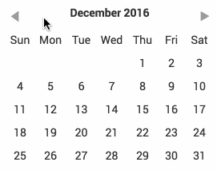
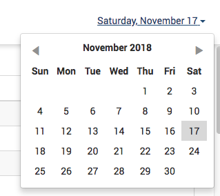

# react-daypicker

[![License][license-image]][license-url]
[![Downloads][downloads-image]][downloads-url]


[![npm badge][npm-badge-png]][package-url]

A simple datepicker inspired by Pikaday.



Try it yourself at the [Storybook](http://blog.cymen.org/react-daypicker).

## Version 3 is a breaking change

With version 3.0.0, all external dependencies are removed except react (as a peer). That means for you
as a consumer that the `active` prop which was a `moment` date is **now expected to be a vanilla
JavaScript date**.

## Installation

### npm
```sh
npm install --save react-daypicker
```

### yarn
```sh
yarn add react-daypicker
```
## Agnostic building block

Note that this component does not draw any border around itself or handle popping
up. That is up to you. I am using it with react-bootstrap v3 and it my usage looks
like this:



## Usage

```javascript
import 'react-daypicker/lib/DayPicker.css';
import DayPicker from 'react-daypicker';
```

The only required property is `onDayClick` which is called when a day is clicked.

```javascript
<DayPicker onDayClick={(day) => this.setState({ day })} />
```

An optional property `active` can be added in order to mark a day as active:

```javascript
<DayPicker
  active={new Date()}
  onDayClick={(day) => this.setState({ day })}
/>
```

**Note that `active` is expected to be an instance of _Date_**. *In prior version of this
component, it was expected to be a Moment.js wrapped date but that is no longer the
case.*

## Passing in custom month and day names

A couple of optional props allow passing in custom month, day and short day names. There isn't any
error handling around these props yet so be sure that you pass in 12 months and 7 days. The props are:

### monthNames

Set `monthNames` prop to an Array of 12 strings which will be used for the month names.

Default: `['January', ... , 'December']`

### longDayNames

Set `longDayNames` prop to an Array of 7 strings which will be used for the long day names. Note that
you need to hover over the short day name to see this long day name. Note the first day must be the
equivalent of Sunday.

Default: `['Sunday', ..., 'Saturday']`

### shortDayNames

Set `shortDayNames` prop to an Array of 7 strings which will be used for the short day names.  Note
the first day must be the equivalent of Sunday.

Default: `['Sun', ..., 'Sat']`

## Options on styling

You can import the Sass stylesheet instead:

```
import 'react-daypicker/src/DayPicker.scss';
```

The root element is `.react-daypicker-root`. The default styling is
intentionally monochrome and basic so that you can drop it into your project
without having to fiddle with styles right away.

This is likely to change in the future with a probable move to `styled-components` or
something similar.

## Dependencies

### Peer

* React

## Developing

See `package.json` for details but simply run `npm run watch` (if changing code,
doesn't work for styles yet) or `npm run build`.

[package-url]: https://npmjs.org/package/react-daypicker
[npm-version-svg]: http://versionbadg.es/cymen/react-daypicker.svg
[npm-badge-png]: https://nodei.co/npm/react-daypicker.png?downloads=true&stars=true
[license-image]: http://img.shields.io/npm/l/react-daypicker.svg
[license-url]: LICENSE
[downloads-image]: http://img.shields.io/npm/dm/react-daypicker.svg
[downloads-url]: http://npm-stat.com/charts.html?package=react-daypicker
